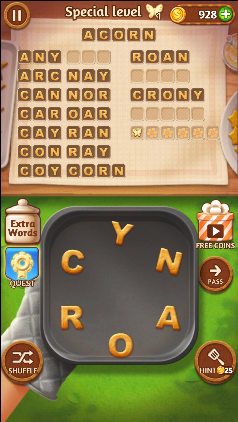

# Solve `Word Cookies`
A simple "hack" to the game Word Cookies. 

I found myself struggling with the game (see a screenshot below), figured I need some sort of help... So I made this one.

Sample usage:

```
# create a word mapping (only required once):
python3 create_mapping.py words-eng-common.txt

# find the words
python3 test_words.py roanyc 5

# sample output:
# ['acorn', 'carny', 'corny', 'crony', 'narco', 'rayon']
```




~~Well, I realized I ruined the game~~

## Credit
* words-complete.txt from [dwyl/english-words](https://github.com/dwyl/english-words)
* words-eng-common.txt from [www-01.sil.org](http://www-01.sil.org/linguistics/wordlists/english/)